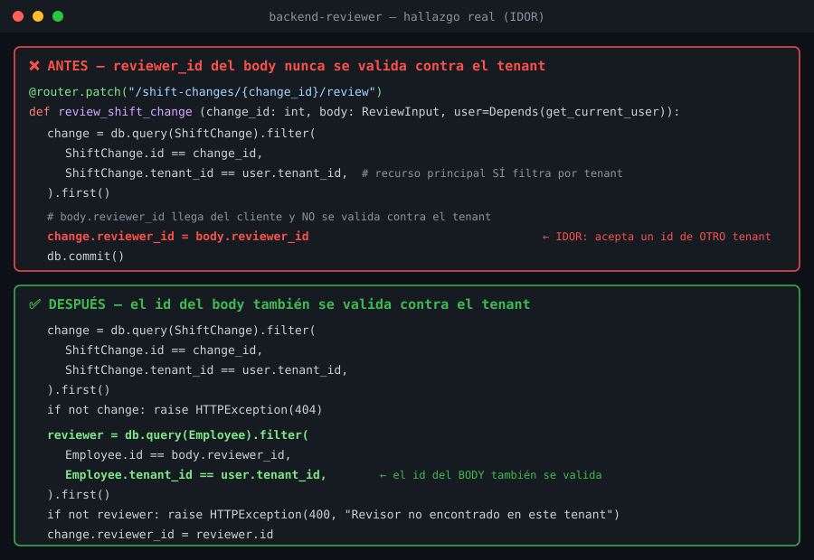

# saas-claude-toolkit

Plugin de Claude Code que empaqueta 5 agentes de revisión de código y 1 skill de arquitectura multi-tenant para arrancar un SaaS B2B desde cero.

`backend-reviewer` (uno de los 5 agentes de este plugin) nace de una auditoría de seguridad real: en una sola sesión encontró y ayudó a corregir 5 fugas de aislamiento multi-tenant (IDOR) en un SaaS en producción. Este es el patrón real que detecta — el id que llega por el **body**, no por la URL, es el que casi nunca se valida:



## Instalación

```bash
claude plugin marketplace add https://github.com/fernando-delrio/saas-claude-toolkit.git
claude plugin install saas-toolkit@saas-claude-toolkit
```

## Qué incluye

**5 agentes**: 4 de solo lectura (`backend-reviewer`, `craft-reviewer`, `conventions-reviewer`, `schema-reviewer`) y 1 que escribe y ejecuta (`test-writer` — tiene Edit, Write y Bash):
- `backend-reviewer` — seguridad (OWASP) y escalabilidad de backend, cualquier lenguaje.
- `craft-reviewer` — calidad y legibilidad de código, cualquier lenguaje.
- `conventions-reviewer` — convenciones de arquitectura frontend (React/Angular/Vue/Svelte).
- `schema-reviewer` — antipatrones de diseño de base de datos relacional (SQL Antipatterns de Bill Karwin).
- `test-writer` — escribe y ejecuta tests (Vitest+MSW / pytest+httpx).

**1 skill nueva**: `saas-multitenant-architecture` — cómo elegir estrategia de aislamiento de tenants, el checklist IDOR, auth, testing y billing multi-tenant. Nace de una auditoría de seguridad real, no de un libro.

## Atribución de fuentes

| Fuente | Autor | Agente/skill |
|---|---|---|
| *A Philosophy of Software Design* | John Ousterhout | `craft-reviewer` |
| Prólogo de *Código Limpio* | James O. Coplien | `craft-reviewer` |
| *Code Complete* | Steve McConnell | `craft-reviewer` |
| *Dive Into Design Patterns* / *Dive Into Refactoring* | Alexander Shvets | `craft-reviewer` |
| SOLID / *Clean Code* | Robert C. Martin | `craft-reviewer` |
| DRY · KISS · YAGNI · SOC · LOD | (principios generales) | `craft-reviewer` |
| *Test Driven Development* | Kent Beck | `test-writer` |
| OWASP Top 10 | OWASP Foundation | `backend-reviewer` |
| *SQL Antipatterns* | Bill Karwin | `schema-reviewer` |

`saas-multitenant-architecture` es experiencia práctica propia (auditoría de seguridad real sobre un SaaS multi-tenant en producción), no deriva de un libro.

## Licencia

MIT — ver [LICENSE](LICENSE).
